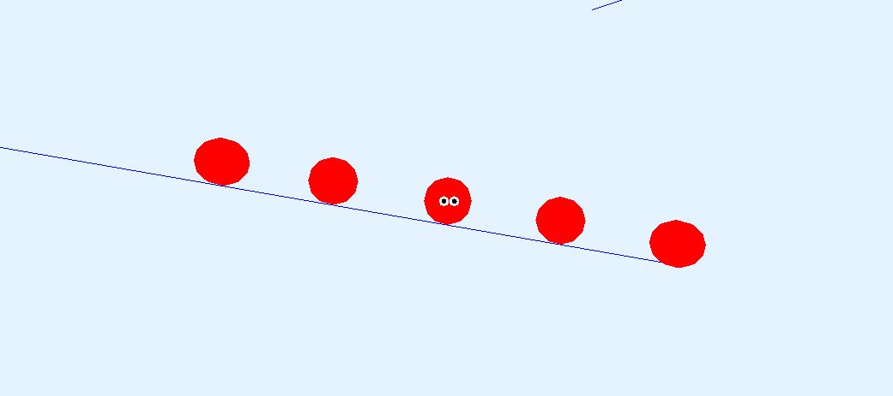

# Cyclone Physics

The Physics engine that accompanies the book "Game Physics Engine Development" by Ian Millington.
This version uses a modern conan/cmake based build system and should build out of the box on Windows and Linux systems.

## Requirements

Development is done with
* Conan 2.x
* CMake 3.27.x
* Windows: Visual Studio 2022 Community Edition
* Linux: Make

## Building

Conan install for debug and release builds
```
conan install . --build=missing --settings=build_type=Debug
conan install . --build=missing --settings=build_type=Release
```

CMake project generation

On Windows
```
cmake --preset conan-default
```

On Linux
```
cmake --preset conan-debug
cmake --preset conan-release
```

On Windows, open the generaed solution file in the build folder.
On Linux use
```
cmake --build build/Debug
cmake --build build/Release
```

## Screenshots - Demos

Ballistic


BigBallistic


Blob


Bridge


Explosion


Fireworks


FlightSim


Fracture


Platform


Ragdoll


Sailboat
